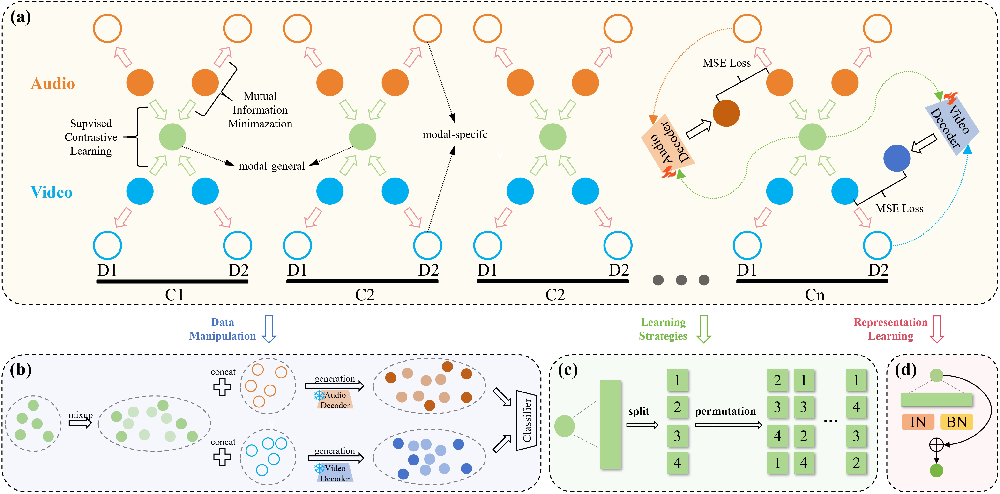
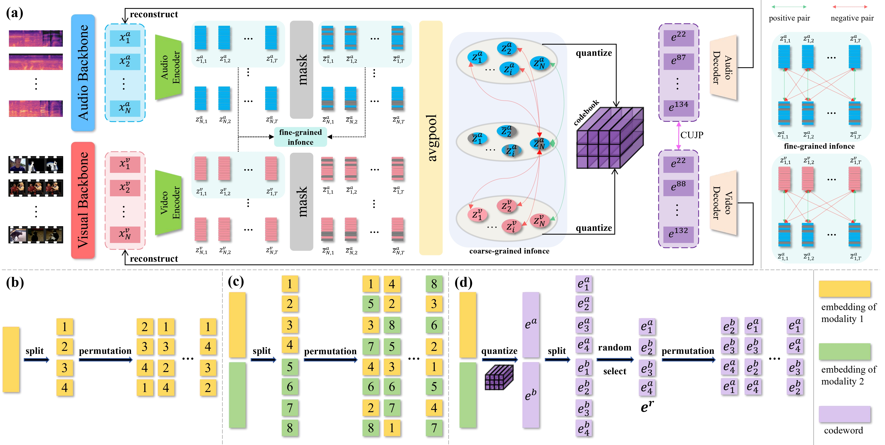
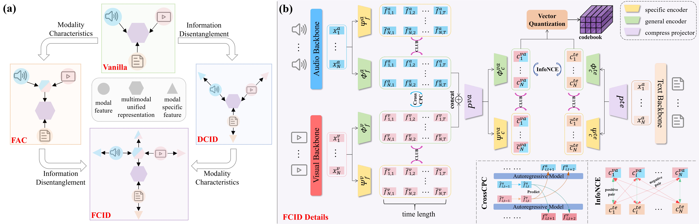
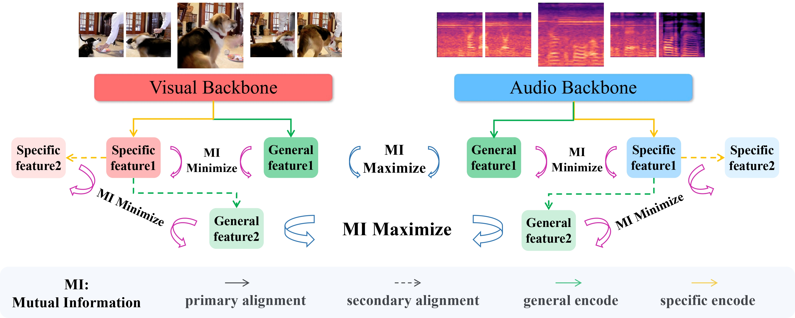








I will graduate in 2026 and am currently seeking job opportunities. If you are interested, please feel free to contact me. My research focuses on unified multimodal representation/alignment and image generation.

# 📝 Publications 

\* indicates equal contribution.

NeurIPS 2023

[Achieving Cross Modal Generalization with Multimodal Unified Representation](https://proceedings.neurips.cc/paper_files/paper/2023/hash/c89f09849eb5af489abb122394ff0f0b-Abstract-Conference.html)

Yan Xia\*, **Hai Huang\***, Jieming Zhu, Zhou Zhao

[**Project**](https://github.com/haihuangcode/CMG) <strong></strong>

ICCV 2025

[Bridging Domain Generalization to Multimodal Domain Generalization via Unified Representations](https://haihuangcode.github.io/)

**Hai Huang**, Yan Xia, Sashuai Zhou, Hanting Wang, Shulei Wang, Zhou Zhao

ICCV 2025

[Open-set Cross Modal Generalization via Multimodal Unified Representation](https://haihuangcode.github.io/)

**Hai Huang**, Yan Xia, Shulei Wang, Hanting Wang, Minghui Fang, Shengpeng Ji, Sashuai Zhou, Tao Jin, Zhou Zhao

ACL 2025

[Enhancing Multimodal Unified Representations for Cross Modal Generalization](https://haihuangcode.github.io/)

**Hai Huang\***, Yan Xia\*, Shengpeng Ji, Shulei Wang, Hanting Wang, Minghui Fang, Jieming Zhu, Zhenhua Dong, Sashuai Zhou, Zhou Zhao

ICASSP 2025

[Semantic Residual for Multimodal Unified Discrete Representation](https://arxiv.org/pdf/2412.19128.pdf)

**Hai Huang**, Shulei Wang, Yan Xia

NAACL 2025

[Overcoming both Domain Shift and Label Shift for Referring Video Segmentation](https://aclanthology.org/2025.findings-naacl.167.pdf)

**Hai Huang**, Sashuai Zhou, Yan Xia

``ICML 2025`` [IRBridge: Solving Image Restoration Bridge with Pre-trained Generative Diffusion Models](), Hanting Wang, Tao Jin, Wang Lin, Shulei Wang, **Hai Huang**, Shengpeng Ji, Zhou Zhao

``CVPR 2025`` [Towards Transformer-Based Aligned Generation with Self-Coherence Guidance](https://arxiv.org/pdf/2503.17675), Shulei Wang, Wang Lin, **Hai Huang**, Hanting Wang, Sihang Cai, WenKang Han, Tao Jin, Jingyuan Chen, Jiacheng Sun, Jieming Zhu, Zhou Zhao

``ACL 2025`` [Towards Simultaneous and Independent Zero-shot Speaker Cloning and Zero-shot Language Style Control](), Shengpeng Ji, Qian Chen, Wen Wang, Jialong Zuo, Minghui Fang, Ziyue Jiang, **Hai Huang**, Zehan Wang, Xize Cheng, Siqi Zheng, Zhou Zhao

``ACL 2025`` [Bridging Discrete Codec Representations and Speech Language Models](), Shengpeng Ji, Minghui Fang, Jialong Zuo, Ziyue Jiang, Dingdong WANG, Hanting Wang, **Hai Huang**, Zhou Zhao

``ACL 2025`` [ACE: A Generative Cross-Modal Retrieval Framework With Coarse-To-Fine Semantic Modeling](), Minghui Fang, Shengpeng Ji, Jialong Zuo, **Hai Huang**, Yan Xia, Jieming Zhu, Xize Cheng, Xiaoda Yang, Wenrui Liu, Gang Wang, Zhenhua Dong, Zhou Zhao

``ACM MM 2025`` [TAP: Parameter-efficient Task-Aware Prompting for Adverse Weather Removal](), Hanting Wang, Shulei Wang, Shengpeng Ji, **Hai Huang**, Xiao Jin, Qifei Zhang, Tao Jin

``ICME 2025 (Oral)`` [Enhancing Multi-modal Models with Heterogeneous MoE Adapters for Fine-tuning](https://arxiv.org/pdf/2503.20633), Sashuai Zhou, **Hai Huang**, Yan Xia

``NAACL 2025`` [Omni-Chart-600K: A Comprehensive Dataset of Chart Types for Chart Understanding](https://aclanthology.org/2025.findings-naacl.226.pdf), Shulei Wang, Shuai Yang, Wang Lin, Zirun Guo, Sihang Cai, **Hai Huang**, Ye Wang, Jingyuan Chen, Tao Jin

# 🎖 Honors and Awards
- *2021.10* First Prize in the [RoboMaster Robotics Competition](https://www.robomaster.com)

# 📖 Educations
- *2023.09 - 2026.03*, master, Artificial Intelligence, Zhejiang University
- *2019.09 - 2023.06*, bachelor, Computer Science and Technology, Northeastern University(China)

# 💻 Internships
- *2025.01 - 2025.07*, Pretraining a 6B-parameter image generation model (DiT)
