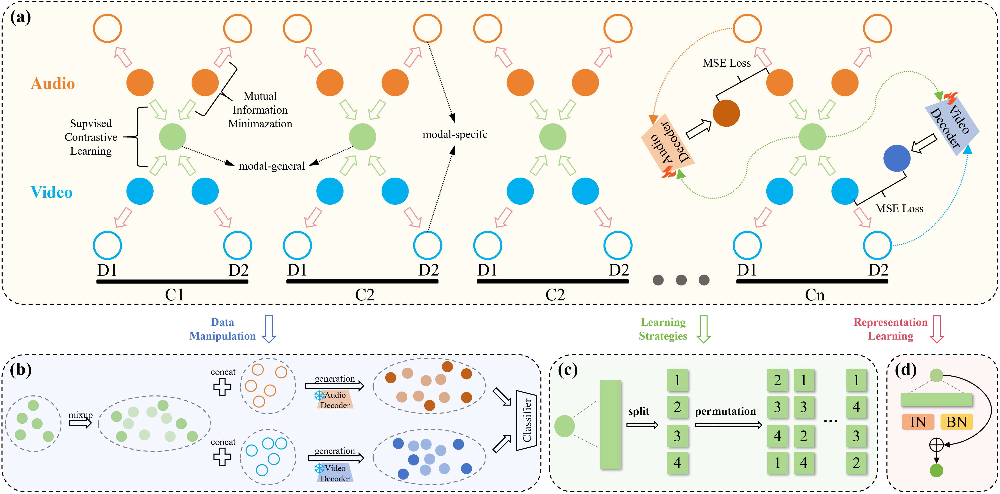
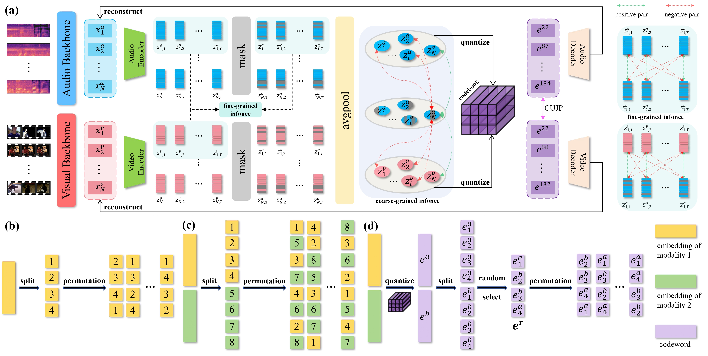
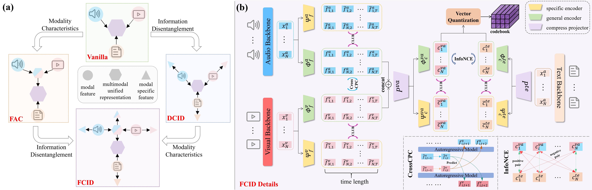
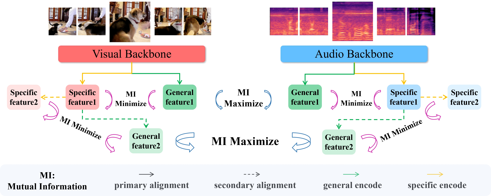

---

permalink: /
title: ""
excerpt: ""
author_profile: true
redirect_from:

* /about/
* /about.html

---








I am currently with the **Meituan LongCat Team**, working on **unified multimodal models**.

My recent work focuses on multimodal representation learning, unified understanding-generation systems.

Contact: <a href="mailto:haihuangcode@outlook.com">haihuangcode@outlook.com</a>

Multimodal Learning
Unified Multimodal Models
Cross-modal Generalization
Understanding & Generation

# Publications

* indicates equal contribution.

NeurIPS 2023

[Achieving Cross Modal Generalization with Multimodal Unified Representation](https://proceedings.neurips.cc/paper_files/paper/2023/hash/c89f09849eb5af489abb122394ff0f0b-Abstract-Conference.html)

Yan Xia*, **Hai Huang***, Jieming Zhu, Zhou Zhao

[Project](https://github.com/haihuangcode/CMG) <strong></strong>

ICCV 2025

**Bridging Domain Generalization to Multimodal Domain Generalization via Unified Representations**

**Hai Huang**, Yan Xia, Sashuai Zhou, Hanting Wang, Shulei Wang, Zhou Zhao

ICCV 2025

**Open-set Cross Modal Generalization via Multimodal Unified Representation**

**Hai Huang**, Yan Xia, Shulei Wang, Hanting Wang, Minghui Fang, Shengpeng Ji, Sashuai Zhou, Tao Jin, Zhou Zhao

[Project](https://github.com/haihuangcode/CMG/tree/master/ICCV25-OSCMG)

ACL 2025 Findings

**Enhancing Multimodal Unified Representations for Cross Modal Generalization**

**Hai Huang***, Yan Xia*, Shengpeng Ji, Shulei Wang, Hanting Wang, Minghui Fang, Jieming Zhu, Zhenhua Dong, Sashuai Zhou, Zhou Zhao

[Project](https://github.com/haihuangcode/CMG/tree/master/ACL25-FCID%26TOC)

ICASSP 2025

[Semantic Residual for Multimodal Unified Discrete Representation](https://arxiv.org/pdf/2412.19128.pdf)

**Hai Huang**, Shulei Wang, Yan Xia

NAACL 2025 Findings

[Overcoming both Domain Shift and Label Shift for Referring Video Segmentation](https://aclanthology.org/2025.findings-naacl.167.pdf)

**Hai Huang**, Sashuai Zhou, Yan Xia

# Honors

* *2025.10* National Scholarship
* *2021.10* First Prize, [RoboMaster Robotics Competition](https://www.robomaster.com)

# Education

* *2023.09 - 2026.03*, M.S. in Artificial Intelligence, Zhejiang University
* *2019.09 - 2023.06*, B.S. in Computer Science and Technology, Northeastern University, China

# Experience

* *2025.01 - 2025.07*, Huawei, pretraining a 6B-parameter image generation model based on DiT
